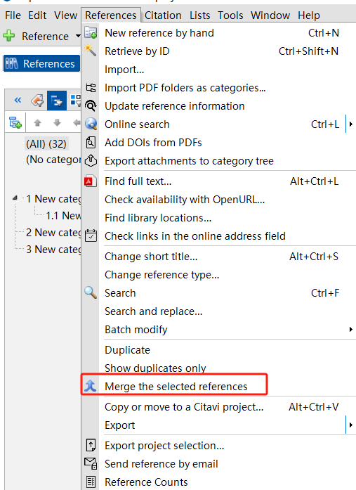
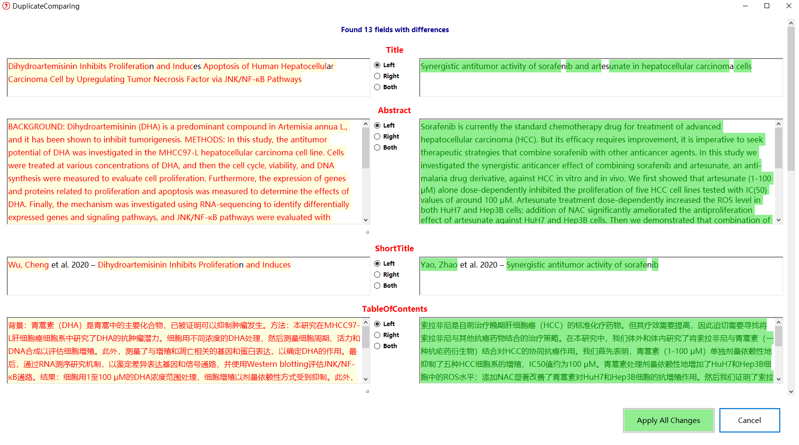
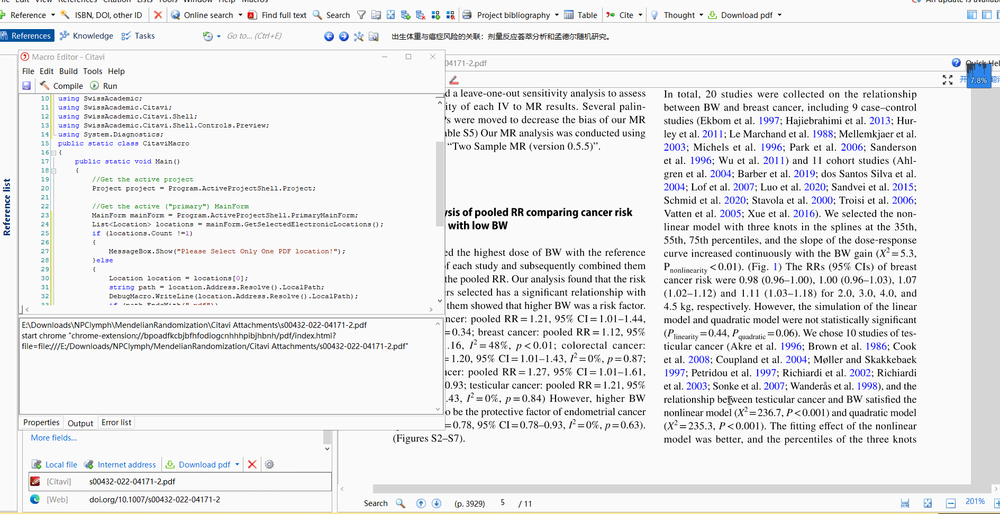

# myCitaviAddonCode
This is my Citavi 6.8 addons repo

each folder is one single addon, including code and VS 2022 project file.

Any problem can contact me with QQ(3060191344) or email csuxiehui@outlook.com.

## BatchModifyOfSearchForm

在主界面中通过设置过滤器，在文献窗格显示搜索框中选中的文献。支持一键按钮，对搜索框中选中的文献进行批量 Category 和 Group 赋予和删除操作。

## CitaviAddonTutorial

Citavi 插件开发教程项目，提供插件开发的示例代码和文档说明。

## CopyLocationPathToClipboard

一个简单的 Citavi 插件，用于快速将一个或多个附件的本地文件路径复制到剪贴板。

**功能**
当你在 Citavi 中管理参考文献的附件时，经常需要获取文件的本地路径用于其他操作（例如，在文件管理器中打开、在命令行中使用、或在其他程序中引用）。这个插件提供了一个便捷的"一键复制"功能。

- **一键复制**：在附件的右键菜单中添加了一个新按钮。
- **多选支持**：可以同时选中多个附件，一次性将所有路径复制到剪贴板，每个路径占一行。
- **路径格式化**：复制的路径会被双引号（"）括起来，方便在命令行等环境中直接使用。

**使用方法**
在 Citavi 的参考文献视图中，右键点击一个或多个电子附件。
在弹出的上下文菜单中，选择"将文件路径复制到剪贴板"。
文件的完整本地路径就会被复制到你的系统剪贴板中，你可以直接粘贴到任何地方。

## CopyTextOfSelectedAnnotationAddon

**一键复制批注文本**
在Citavi的PDF预览中选中任意知识条目（高亮或下划线）。
点击工具栏"工具"菜单中的"CopyTextOfSelectedAnnotation"按钮，或使用快捷键 Shift + C。
该批注的完整文本内容将被精确提取并复制到剪贴板。

**一键生成Obsidian链接**
在Citavi的PDF预览中选中一个或多个知识条目。
点击工具栏"工具"菜单中的"CopyFormattedLink"按钮，或使用快捷键 Shift + Ctrl + O。
插件会自动生成一个格式化的Obsidian Markdown链接并复制到剪贴板。

**智能启用**：插件按钮仅当你在PDF预览模式下且选中了支持的知识条目（如知识条目、任务项）时才会被激活，避免误操作。
**路径解析**：生成Obsidian链接时，插件会自动解析PDF在你的电脑上的绝对路径，并转换为Obsidian兼容的 file:/// 格式。
**唯一标识**：生成的链接末尾包含 KnowID，这是Citavi中知识条目的唯一ID，方便你未来进行更高级的自动化管理。

## DuplicateComparing

像 EndNote 一样对比重复文件，帮助用户识别和管理重复的参考文献条目。

效果如下：

## JumpToLastPositionAfterActionExecutionAddon

在Citavi的PDF阅读器的工具菜单中添加命令"跳转到上一个位置..."，快捷键为ALT+F3。如果文档中包含内部链接，并且通过点击内部链接进行了跳转，该命令就会生效。在执行跳转之前的最后位置会被保存，只要文档保持打开状态，这个位置就会一直被保存。

适配 Citavi 6.18

## KnowledgePanelShowPDF

一个强大的 Citavi 插件，旨在打通知识项目与 PDF 预览之间的壁垒，实现精准、即时的导航和高亮。

**功能**
你是否厌倦了在 Citavi 的知识项目列表和 PDF 预览窗口之间来回切换，手动寻找对应的注释位置？这个插件解决了这个痛点，它提供了以下核心功能：

- **一键跳转**：在知识组织器中右键点击任何知识项目，选择"在当前视图的右边栏预览PDF"，即可立即在右侧预览面板中打开并跳转到该知识项目对应的 PDF 位置。
- **实时联动**：
  - 在知识组织器中点击不同的知识项目，右侧的 PDF 预览会自动跳转到相应位置。
  - 在参考文献编辑器的引文列表中点击不同的引文，右侧的 PDF 预览也会自动跳转。
- **智能预览**：当点击的知识项目关联的 PDF 尚未在预览中打开时，插件会自动在预览面板中加载它。

**使用方法**
**手动跳转**：
在知识组织器中，右键点击一个知识项目。
在弹出的菜单中选择"在当前视图的右边栏预览PDF"。

**自动联动**：
- 知识组织器：只需在列表中单击不同的知识项目，右侧的 PDF 就会自动跟随跳转。
- 参考文献编辑器：在引文列表中单击不同的引文，右侧的 PDF 也会自动跟随跳转。

**工作原理**
该插件通过订阅 Citavi 内部控件的列表项变更事件（ActiveListItemChanged）来实现实时联动。当用户在列表中切换选择时，插件会捕获这个事件，并执行以下操作：
获取当前选中的知识项目或引文。
查找与之关联的 PDF 注释（Annotation）。
调用 Citavi 的 PDF 预览控件，使其直接跳转到该注释的位置。

## MacroManagerWithAutoRef

MacroManager插件加入AutoRef插件的功能，在MacroManager的edit和run运行的时候能够自动加载引用。
> 原版AutoRef只有先打开macros editor，然后open一个新的宏文件，才会自动加载引用，相对鸡肋。

## PDFBookmarkExpandCollapse

在PDF预览的书签页面添加一个全部展开/收起的按钮，方便用户快速导航复杂的文档结构。
并且让侧边栏默认是在书签页面。

## PDFSidebarTranslation

**实时划词翻译**
在Citavi的PDF预览界面中，用鼠标选中任意单词、句子或段落。
插件会自动将选中的文本捕获到侧边栏的"翻译"面板中。
点击"翻译"按钮，即可调用翻译API（默认配置为GLM模型）将文本翻译成中文。
翻译结果会清晰地显示在下方的"译文"区域。

**智能配置管理**
插件支持自定义API密钥和翻译提示词（Prompt），以适应不同领域的翻译需求（如医学、法律、计算机等）。
配置信息会自动保存在Citavi启动目录下的 TranslationConfig.json 文件中，下次启动时自动加载。
提供了"自动翻译"选项，开启后，选中文本将自动触发翻译，无需手动点击。

## PDFThumbnailAddon

**使用缩略图导航：**
在Citavi中打开任意PDF文件。
在右侧的侧边栏中，点击新增的缩略图图标（通常是一个图片样式的图标）。
在打开的"缩略图"面板中，浏览页面，点击你想要跳转的页面缩略图。
主预览区域将立即跳转到该页。

## QuotationsToolbox

引文工具箱，提供引文管理和格式化的增强功能，帮助用户更高效地处理引用文献。

## ReferenceGridFormWorkSpaceEditor

这个插件允许您将列和分组的选择保存为一个工作区。

这是官方版本经过我修改的插件。我在工具栏上添加了菜单，这样更加方便。

**功能特点：**
- 保存和加载自定义的列显示配置
- 保存分组筛选设置
- 工具栏快速访问
- 一键切换不同工作区

Note: 将插件文件拷贝到 Addon folder, 没有二级文件夹.

## ReleaseFiles

发布文件集合，包含编译后的插件文件和相关依赖，方便用户直接使用。

## ScrollSpeedInPdfPreview

修复Citavi官方PDF预览滚动速度Bug，提供更流畅的阅读体验。

## ScrollSpeedInPdfPreview6.18

专门适配Citavi 6.18版本的PDF预览滚动速度修复插件。

## SearchInActiveGroup

在活动的群组或分类中进行高级搜索，就是打开高级搜索界面并自动填写群组/分类名称。

### SearchInActiveCategory

### SearchInActiveGroup

## SetMainFormFont

允许用户自定义Citavi主界面的字体设置，包括字体类型、大小和样式，提升视觉体验。

## SetPDFSelectionAsAddon
一个高效的 Citavi 插件，允许你在 PDF 预览时，直接将选中的文本一键设置为文献的标题或作者，无需手动复制粘贴。
**功能概述**
在阅读和录入文献信息时，我们经常需要从PDF中复制标题、作者等信息，然后粘贴到Citavi的相应字段中。这个插件将这个过程简化为一步操作：在PDF中选中文本，点击一下按钮，信息就自动填好了。
**核心功能**
- **一键设置标题**：在PDF中选中文献标题文本，点击"设为标题"按钮，文本将自动填充到当前文献条目的`Title`字段。
- **智能识别作者（名前姓后）**：选中作者列表（格式如 "John Smith, Jane Doe"），点击"作者(名前姓后)"按钮，插件会自动解析并添加多位作者到`Authors`字段。
- **智能识别作者（姓前名后）**：选中作者列表（格式如 "Smith, John; Doe, Jane"），点击"作者(姓前名后)"按钮，插件会按此格式解析并添加作者。
- **专门支持中文姓名**：考虑到中文姓名的构成特点，提供"中文姓名"按钮。选中如"张三"的文本，点击后插件会自动识别"张"为姓、"三"为名，并正确添加到作者字段中。
**使用方法**
1. 在 Citavi 中打开一个 PDF 文件进行预览。
2. 用鼠标选中你想要提取的文本（标题或作者）。
3. 在PDF预览窗口的工具栏中，点击"更多"按钮。
4. 在下拉菜单中，根据你选中的文本类型，点击相应的按钮：
   - 设为标题
   - 作者(名前姓后)
   - 作者(姓前名后)
   - 中文姓名
5. 选中的文本会自动被处理并填充到对应字段，同时PDF上的选中文本会被自动取消选中。
**智能显示**
插件的所有按钮都具备智能显示功能：
- 只有在PDF预览模式下，按钮才会出现在菜单中。
- 只有当你真正选中了文本时，这些按钮才会变为可用状态，避免了误操作，保持了界面的整洁。

## SetTableViewFont

允许用户自定义Citavi表格视图的字体设置，优化数据显示效果和阅读舒适度。

## ShowReferenceFromSearchForm

在主界面中显示搜索界面中选择的参考文献。

## ShowReferenceFromTableView

在主界面中显示table视图界面中选择的参考文献。

## SortKnowledgeItemsInSelectionAndCreateSubheadings

对Knowledge里选中的知识点按文献、PDF页码这两个方面进行排序，然后添加在每个文献的Knowledge前面添加一个subheading。
> 是QuotationsToolbox的功能

## SwitchToMainWindow

从TableView快速切换回MainWindow。

## SwitchToTableView

从MainWindow快速切换到TableView。

## TextMarkerGrayWithoutKnowledge

一个轻量级的 Citavi 插件，允许你在 PDF 中创建临时的、不会保存为知识项目的高亮标记。

**功能**
在阅读和批注 PDF 时，我们有时只想用颜色标记一下重点，但并不想将其作为正式的知识项目保存到 Citavi 数据库中。这个插件就是为了满足这个需求而生的。

- **临时高亮**：在 PDF 中选中文本后，点击插件按钮或使用快捷键 B，即可创建一个灰色的高亮标记。
- **非知识项目**：创建的高亮不会出现在你的知识组织器中，也不会与任何参考文献关联，它纯粹是 PDF 文件上的一个视觉标记。
- **智能显示**：插件按钮只在 PDF 预览窗口且选中的是文本时才显示，保持界面整洁。
- **快捷键支持**：使用快捷键 B 可以快速创建临时高亮，提升阅读效率。

**使用方法**
在 Citavi 的 PDF 预览窗口中，用鼠标选中你想要标记的文本。
执行以下任一操作：
- 点击预览工具栏中的"用灰色高亮但不保存Knowledge"按钮。
- 直接按下键盘快捷键 B。

## TranslateGPTInCitavi
> 删除，项目放弃

打开一个ChatGPT网站，实现Citavi和网页之间的通讯和数据交换，以便我们可以批量翻译Citavi中的标题和摘要，或者更快地向ChatGPT提问。
（注意：该方法模拟浏览器访问ChatGPT镜像网站，该网站可能随时关闭，需要经常进行调整。）

**Requirements**: 
Selenium.RC.3.1.0
Selenium.Support.4.14.1
Selenium.WebDriver.MSEdgeDriver.118.0.2088.41 -> Edge 118.0.2088.xx (x64)
Selenium.WebDriver.4.14.1
System.Drawing.Common.7.0.0; Newtonsoft.Json.13.0.1 (Install automaticly by Selenium)

