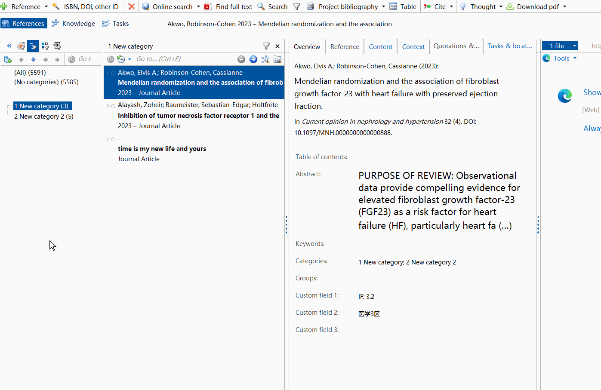
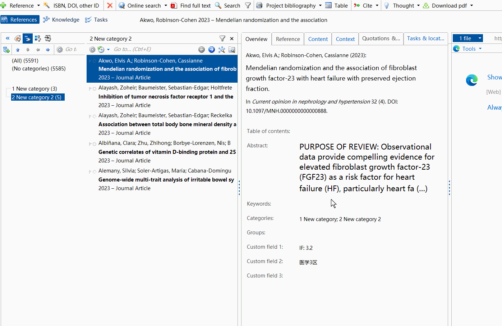
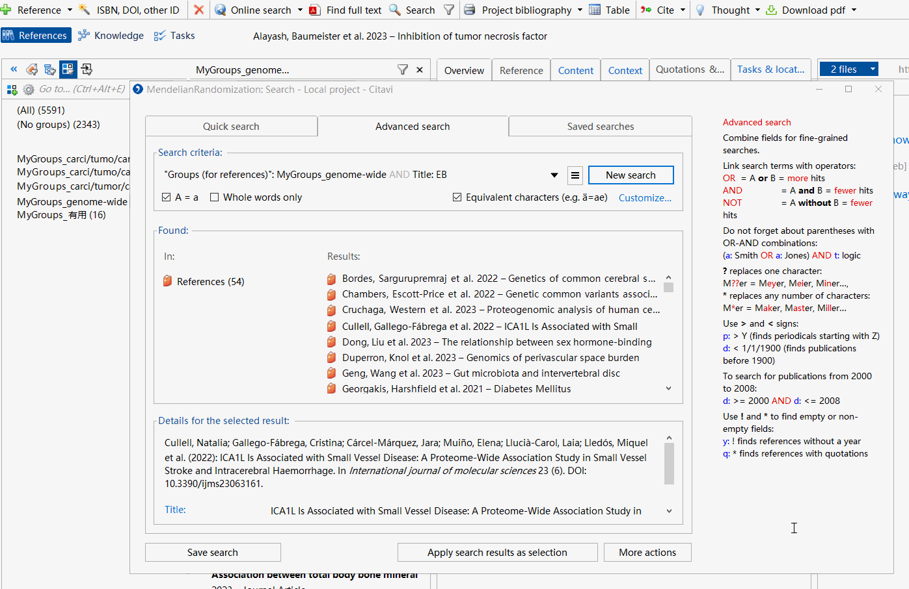
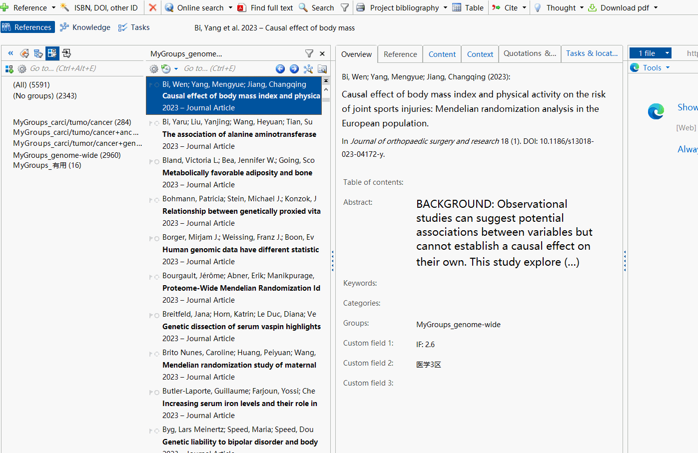
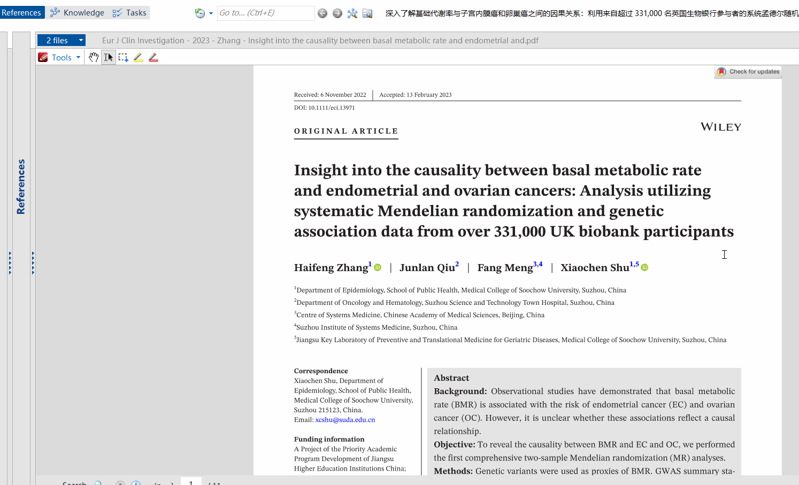
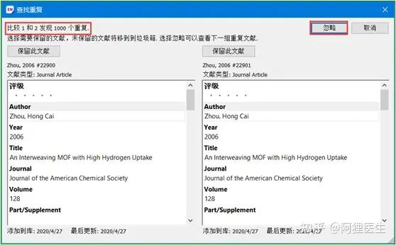
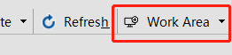

# myCitaviAddonCode
This is my Citavi 6.8 addons repo

each folder is one single addon, including code and VS 2022 project file.

## SearchInActiveGroup

Advanced search in active group or category, it is just open advanced search form and fill the group/category name automaticly.

在活动的群组或分类中进行高级搜索，就是打开高级搜索界面并自动填写群组/分类名称。

### SearchInActiveCategory

### SearchInActiveGroup

## ShowReferenceFromSearchForm

Show selected reference of search form in main form。
在主界面中显示搜索界面中选择的参考文献。

## ShowReferenceFromTableView

Show active reference of table view in main form
在主界面中显示table视图界面中选择的参考文献。

## ScrollSpeedInPdfPreview

Fix the official bug
修复官方Bug

## DuplicateComparing

- [ ] **In processing**, compare duplicates like endnote
- [ ] **进行中**, 像endnote一样对比重复文件

## SwitchToMainWindow

Switch back to MainWindow quickly from TableView.

从TableView快速切换回MainWindow

## SwitchToTableView

Switch to TableView quickly from MainWindow.

从MainWindow快速切换到TableView

## ReferenceGridFormWorkSpaceEditor

This add-on lets you save your selection of columns and groups as a work area.

This is the modified addon from official. I add the menu to the tool bar, it would be more convenient.

这个插件允许您将列和分组的选择保存为一个工作区。

这是官方版本经过我修改的插件。我在工具栏上添加了菜单，这样更加方便。

Note: 将插件文件拷贝到 Addon folder, 没有二级文件夹.

 

 

## TranslateGPTInCitavi

Open a chatGPT website, communicating and exchanging data between Citavi and web pages, so that we can batch translate Title and Abstract in Citavi, and ask chatGPT quicker. 
(Note: This method simulates browser access to the ChatGPT mirror website, which may be shut down at any time, requiring frequent adjustments.)

打开一个ChatGPT网站，实现Citavi和网页之间的通讯和数据交换，以便我们可以批量翻译Citavi中的标题和摘要，或者更快地向ChatGPT提问。
（注意：该方法模拟浏览器访问ChatGPT镜像网站，该网站可能随时关闭，需要经常进行调整。）

**Requirements**: 
Selenium.RC.3.1.0
Selenium.Support.4.14.1
Selenium.WebDriver.MSEdgeDriver.118.0.2088.41 -> Edge 118.0.2088.xx (x64)
Selenium.WebDriver.4.14.1
System.Drawing.Common.7.0.0; Newtonsoft.Json.13.0.1 (Install automaticly by Selenium)

